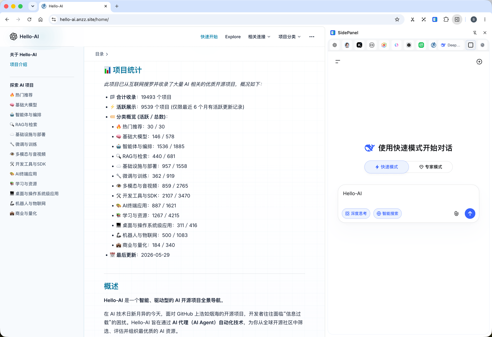
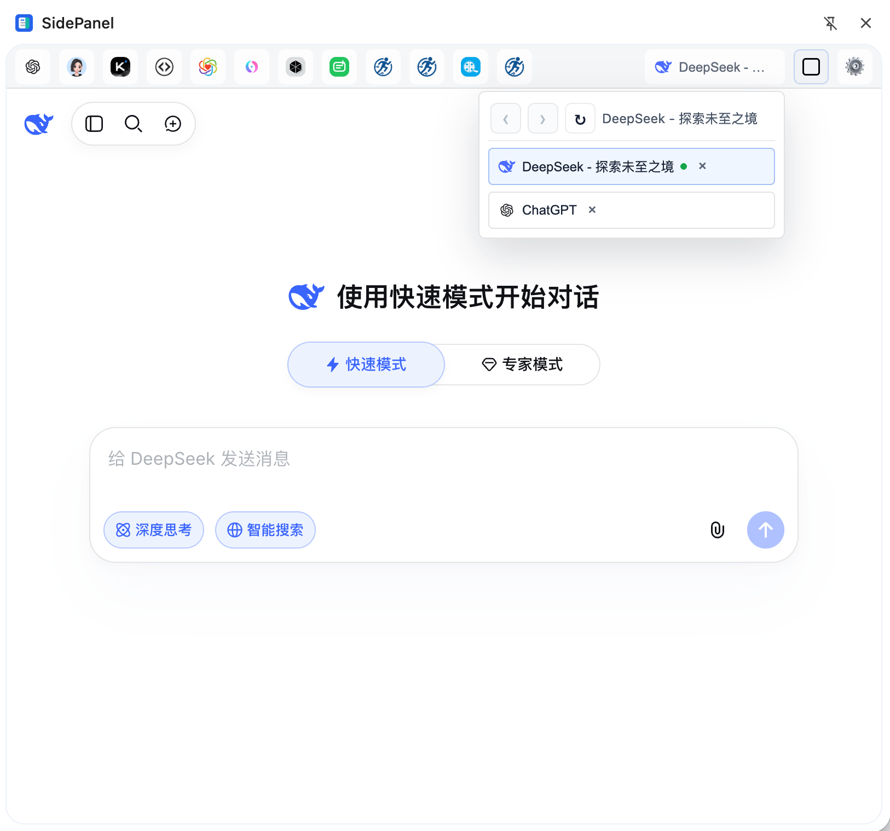
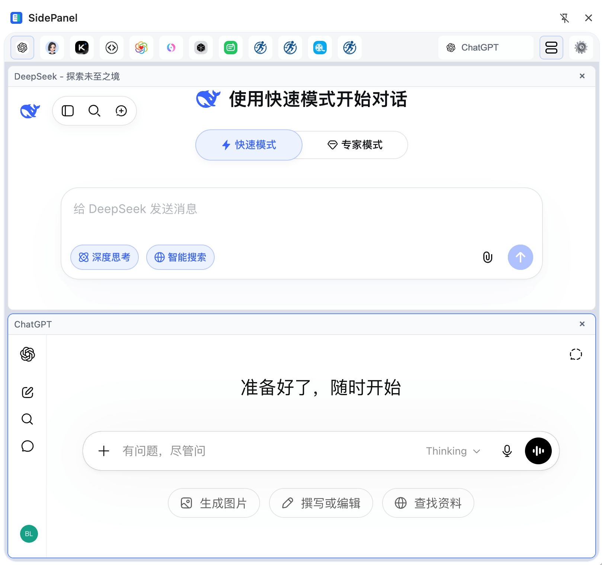
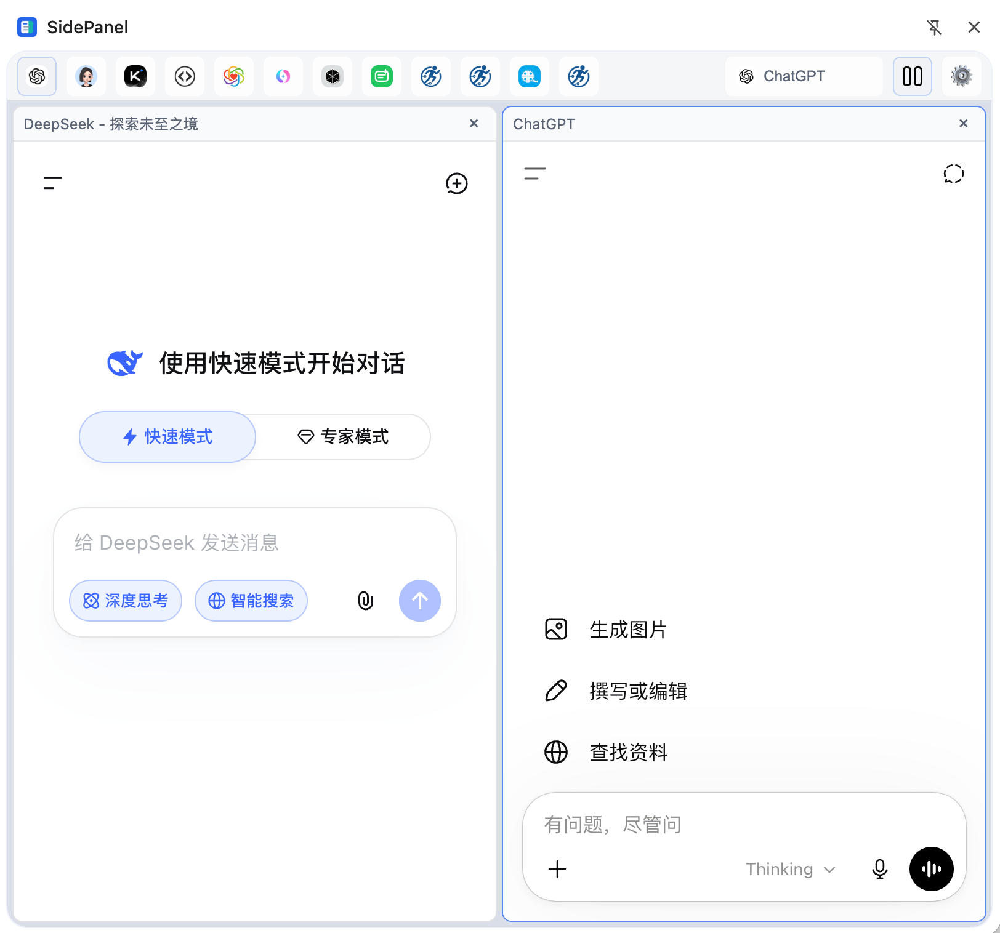
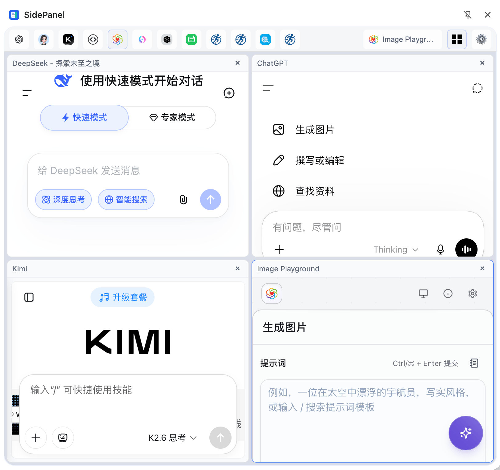

<div align="center">
  
  <h1>SidePanel</h1>
  <p>把常用网站放进 Chrome 侧栏，边浏览主页面边使用 AI、文档、工具站和工作台。</p>
</div>

<div align="center">

[](./LICENSE)
[](https://developer.chrome.com/docs/extensions/reference/api/sidePanel)
[](./docs/technical-guide.md)
[](https://vuejs.org/)
[](#快速上手)

</div>

---

SidePanel 是一个面向高频浏览器用户的 Chrome 侧栏导航插件。它不只是把网页塞进侧栏，而是把常用站点、临时页面、右键入口、快捷键和多分屏浏览组织在一个轻量工作台里，让你少开标签页，少来回切换。



## 项目特色

- **把常用网站固定在浏览器侧栏**：AI 助手、文档、代码工具、监控页、信息看板都可以放在右侧，需要时点击图标直接打开。
- **不打断当前浏览上下文**：当前网页继续留在主窗口，侧栏负责承载辅助信息、工具页面和临时参考页。
- **右键和快捷键都能快速进入侧栏**：页面和链接可以通过右键打开或加入侧栏；当前页面也可以用快捷键直接打开或保存。
- **分屏查看多个网页**：支持单屏、左右分屏、上下分屏和四宫格，适合对照资料、查看工具输出或同时监控多个轻量页面。
- **快捷站点可长期维护**：支持新增、编辑、删除、拖拽排序和自定义图标，浏览器重启后依然保留。
- **安装权限尽量克制**：安装时不直接申请所有网站权限，打开或添加具体站点时再申请对应站点权限。

## 它解决什么问题

当你一边浏览网页，一边频繁使用 ChatGPT、资料站、内部工具、翻译页面或监控面板时，浏览器标签会很快变得混乱。SidePanel 把这些“辅助页面”收进侧栏：

- **少切标签**：常用工具固定在侧栏，主页面不用离开。
- **临时查资料更轻**：右键页面或链接，直接放进侧栏临时查看。
- **常用入口可沉淀**：有价值的网站可以一键加入快捷栏，下次直接打开。
- **多页面对照更自然**：分屏里同时打开多个网页，不需要把窗口手动摆来摆去。
- **浏览器侧栏更像工作台**：已打开页面、快捷入口、分屏布局和管理面板都在同一个界面里。

## 适合谁使用

- **AI 高频用户**：把 ChatGPT、豆包、Kimi 或其他 AI 页面固定在侧栏，边看网页边提问。
- **开发者**：把文档、代码工具、状态页、接口示例页放在侧栏，减少标签页切换。
- **内容与运营人员**：一边浏览素材和数据，一边打开热点、文档、编辑器或参考页面。
- **研究与资料整理用户**：把当前页面、链接和资料站放进分屏中对照阅读。
- **喜欢轻量浏览器工作流的人**：不想装复杂工作台，只想让 Chrome 侧栏真正可用。

## 快速上手

1. 点击 Chrome 工具栏里的 **SidePanel** 图标，打开侧栏。
2. 点击右侧快捷栏里的站点图标，在侧栏中打开网页。
3. 在任意网页或链接上右键，选择「在侧栏打开」临时查看。
4. 右键选择「加入侧边栏」，把当前页面或链接保存为快捷入口。
5. 点击分屏按钮，切换单屏、左右分屏、上下分屏或四宫格。
6. 点击齿轮按钮，新增、编辑、删除或调整快捷网站。

默认快捷键：

| 操作 | Windows / Linux / ChromeOS | macOS |
| --- | --- | --- |
| 在侧栏打开当前页面 | `Alt+Shift+S` | `Control+Shift+S` |
| 将当前页面加入侧栏 | `Alt+Shift+A` | `Control+Shift+A` |

如果默认快捷键和你的浏览器或系统冲突，可以打开 `chrome://extensions/shortcuts` 自定义。

## 文档入口

根 README 只保留用户视角概要。更多内容按场景阅读：

- [技术与开发说明](./docs/technical-guide.md)：技术栈、目录结构、本地开发、构建验证、发布流程和实现细节。
- [分屏功能需求](./docs/split-view-requirements.md)：分屏交互、布局规则、非目标和验收标准。
- [发布流程](./RELEASE.md)：版本号、CHANGELOG、GitHub Actions Release 和故障处理。
- [更新日志](./CHANGELOG.md)：版本变更记录。

## 界面预览

| 默认 | 上下分屏 |
| --- | --- |
|  |  |

| 左右分屏 | 四宫格分屏 |
| --- | --- |
|  |  |

## 本地运行

```bash
pnpm install
pnpm build
```

然后在 Chrome 中加载：

1. 打开 `chrome://extensions/`
2. 开启「开发者模式」
3. 点击「加载已解压的扩展程序」
4. 选择项目生成的 `dist` 目录

开发调试可运行：

```bash
pnpm dev
```

普通 Vite 开发页不会具备 Chrome 扩展 API，但页面不应因为缺少 `chrome` 全局而崩溃。

## 已知问题

- **不是所有网站都能在侧栏里正常显示**：SidePanel 的工作方式类似于把目标网页放进浏览器右侧的一个小窗口里。有些网站出于安全、登录或支付等原因，会主动拒绝被放进这种窗口，所以可能出现空白页、加载失败、按钮不可用或自动跳回原网页。
- **这通常不是添加失败**：如果某个网站加入侧栏后无法显示，快捷入口仍然可以保存，只是这个网站本身不允许在侧栏中完整打开。遇到这种情况，建议直接在普通标签页中访问该网站。
- **更适合放轻量工具和参考页面**：文档、搜索结果、信息看板、公开工具页通常更容易正常显示；网银、支付、复杂后台、强登录站点更可能受限制。
- 插件会在打开或添加具体站点时申请对应站点权限，用来提升侧栏内网页加载兼容性。
- 建议优先用于个人效率场景；如果用于团队环境，请先评估站点权限和安全边界。

## 许可证

MIT
